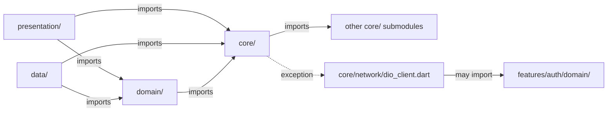
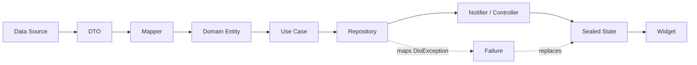

# AGENTS.md

> Canonical context for any AI or human contributor on
> `flutter_clean_riverpod_boilerplate`. This is the single index of project
> conventions, deep dives, and the cookbook of atomic tasks. Everything
> that used to live in `AI_RULES.md` now lives here -- if a rule is not in
> this document, it is not a project rule.

---

## Snapshot

- **Repo**: `flutter_clean_riverpod_boilerplate`
  (`/Users/bs1101/Personal/1.projects/flutter_clean_riverpod_boilerplate`).
- **Stack**: Flutter 3.41.8 (via FVM), Clean Architecture feature-first,
  hand-written Riverpod, `fpdart` `Either<Failure, T>`, `go_router` with
  typed route names, Dio REST, ARB l10n, Material 3.
- **Flavors**: dev / staging / prod. Entrypoints: `lib/main_dev.dart`,
  `lib/main_staging.dart`, `lib/main_prod.dart`. `lib/main.dart` defaults
  to prod.
- **Platforms**: iOS + Android phones. No web, no tablet layouts.
- **Command prefix**: every Flutter / Dart command goes through `fvm`
  (`fvm flutter ...`, `fvm dart ...`).
- **Pre-PR gate (all three must be clean)**: `dart format --set-exit-if-changed`,
  `flutter analyze`, `flutter test`.

## Non-negotiables (the 60-second version)

1. **Clean Architecture layering**: `presentation` and `data` both import
   `domain`; `domain` imports `core` only. `data -> presentation` is
   forbidden. Cross-feature access only via
   `features/<x>/<x>_providers.dart`.
2. **Errors are values**: repositories / use cases / controllers return
   `Future<Either<Failure, T>>`. `try` / `catch` is reserved for
   `bootstrap.dart`, the Dio interceptor, and tests.
3. **Sealed UI states**: every controller exposes a `sealed class` state;
   widgets render via exhaustive `switch`.
4. **Hand-written Riverpod**: no `@riverpod` codegen, no
   `riverpod_generator`, no `freezed`, no `json_serializable`, no
   `build_runner` for tests or DTOs.
5. **Typed routes**: navigate with `context.goNamed(TodoRoutes.detail,
   pathParameters: {'id': id})`. Never raw paths outside
   `app_router.dart`.
6. **Styling**: `AppSize.*` for sizes, `ColorScheme` / `AppSemanticColors`
   for colors, `AppCustomTextStyles` / `textTheme` for type. No inline
   literals, no `Colors.blue`.
7. **Auth refresh** is centralized in the Dio interceptor (401 -> dedup ->
   retry once -> `onSessionExpired`). Don't re-implement in widgets.
8. **CI** runs on `release*` tags. **CODEOWNERS** gates `core/network/`,
   `core/storage/`, `features/auth/`, Android Gradle, `.github/`.

## Interaction Guidelines

- **User persona**: assume Flutter-proficient; clarify only on intent,
  target flavor, or platform (iOS / Android).
- **Explanations**: skip Dart basics. Explain *project* choices (why this
  layer, why this state class, why this route name).
- **Clarification**: ask before adding a new dependency, a new env
  variable, or anything under a code-owner-gated path -- see
  [code-ownership.md](./docs/agents/code-ownership.md).
- **Dependencies**: prefer the deps already in `pubspec.yaml` (Riverpod,
  fpdart, Dio, go_router, mocktail, etc.). If a new one is genuinely
  needed, explain the win before adding it.
- **Formatting**: use `dart format` (via
  `fvm dart format --set-exit-if-changed .`).
- **Fixes**: use `dart fix` for analyzer cleanup.
- **Linting**: `fvm flutter analyze` (base: `very_good_analysis`).
  **Never** re-enable the 3 disabled rules without maintainer sign-off --
  see [analyzer-overrides.md](./docs/agents/analyzer-overrides.md).

## Deep dives -- `docs/agents/`

| File | What it covers |
|------|----------------|
| [architecture.md](./docs/agents/architecture.md) | Clean Architecture in this repo, layer responsibilities, feature folder shape. |
| [layering-rules.md](./docs/agents/layering-rules.md) | The import graph, what may import what, cross-feature access rules. |
| [feature-recipe.md](./docs/agents/feature-recipe.md) | The canonical 6-file feature template (`auth`, `todo` are the reference). |
| [state-management.md](./docs/agents/state-management.md) | Hand-written Riverpod, `Notifier` + sealed state, `ProviderScope.overrides` for tests. |
| [navigation.md](./docs/agents/navigation.md) | `go_router` setup, typed `*Routes` constants, auth redirect. |
| [deep-links.md](./docs/agents/deep-links.md) | `app_links`, FCM-to-route funnel via `pendingNavigationProvider`. |
| [networking.md](./docs/agents/networking.md) | `DioClient`, interceptors, retry / dedup patterns. |
| [auth-refresh.md](./docs/agents/auth-refresh.md) | 401 -> dedup -> refresh -> retry -> `onSessionExpired`. |
| [error-handling.md](./docs/agents/error-handling.md) | `Failure` hierarchy, `Either` usage, mapping rules. |
| [testing.md](./docs/agents/testing.md) | `mocktail` + `EitherAssertions`, Arrange-Act-Assert, test layout. |
| [flavors.md](./docs/agents/flavors.md) | `env.{dev,staging,prod}.json`, entrypoint wiring, native splash / launcher icons. |
| [localization.md](./docs/agents/localization.md) | ARB workflow, `flutter gen-l10n`, `AppLocalizations`. |
| [logger.md](./docs/agents/logger.md) | `AppLogger` (wraps the `logger` package), tag conventions. |
| [styling.md](./docs/agents/styling.md) | `AppSize`, `ThemeExtension`s, `AppSemanticColors`, `AppCustomTextStyles`. |
| [commands.md](./docs/agents/commands.md) | The `fvm` prefix, `dart format`, `flutter analyze`, `flutter test`, CI. |
| [ci.md](./docs/agents/ci.md) | Tag-driven CI, `release*` triggers, build matrix. |
| [code-ownership.md](./docs/agents/code-ownership.md) | CODEOWNERS-gated paths, how to add a new owner. |
| [git-workflow.md](./docs/agents/git-workflow.md) | Branch naming, commit format, PR conventions, link to `pr-creator`. |
| [analyzer-overrides.md](./docs/agents/analyzer-overrides.md) | The 3 intentionally disabled rules and why. |
| [notifications.md](./docs/agents/notifications.md) | FCM init, foreground / background, deep-link funnel. |

## Tasks -- `docs/tasks/`

Atomic how-to files. Pick the task, follow the file, you get a working
change. Each is independent.

| Task | When to reach for it |
|------|----------------------|
| [add-feature.md](./docs/tasks/add-feature.md) | "I need a new Clean Architecture feature from scratch." |
| [add-screen.md](./docs/tasks/add-screen.md) | "I need a new screen wired into `go_router`." |
| [add-api-endpoint.md](./docs/tasks/add-api-endpoint.md) | "I need a new REST endpoint wired into a repository." |
| [add-deep-link.md](./docs/tasks/add-deep-link.md) | "I need a new `app_links` entry or FCM payload." |
| [add-env-var.md](./docs/tasks/add-env-var.md) | "I need a new key in `env.<flavor>.json`." |
| [add-locale.md](./docs/tasks/add-locale.md) | "I need a new language in `l10n.yaml`." |
| [regenerate-l10n.md](./docs/tasks/regenerate-l10n.md) | "I edited an ARB, now `AppLocalizations` is stale." |
| [regenerate-branding.md](./docs/tasks/regenerate-branding.md) | "I need to refresh launcher icons / splash per flavor." |
| [write-tests.md](./docs/tasks/write-tests.md) | "I need unit / widget / smoke tests for a feature." |
| [run-pre-pr-gates.md](./docs/tasks/run-pre-pr-gates.md) | "About to open a PR, what do I run?" |
| [release-tag.md](./docs/tasks/release-tag.md) | "Cutting a release, what's the tag / CI / signing flow?" |
| [investigate-401-storm.md](./docs/tasks/investigate-401-storm.md) | "Users are getting logged out -- where do I look?" |
| [change-theme-or-colors.md](./docs/tasks/change-theme-or-colors.md) | "I need to change the seed color or a design token." |

## Where to look when...

| Symptom | First file to open |
|---------|---------------------|
| I don't know which layer a file belongs in. | [layering-rules.md](./docs/agents/layering-rules.md) |
| I'm adding a feature and don't know the folder shape. | [feature-recipe.md](./docs/agents/feature-recipe.md) |
| The `go_router` redirect is fighting me. | [navigation.md](./docs/agents/navigation.md) |
| 401s are repeating / users are logged out. | [auth-refresh.md](./docs/agents/auth-refresh.md) |
| A widget needs state and I'm not sure what kind. | [state-management.md](./docs/agents/state-management.md) |
| The build broke after an env change. | [flavors.md](./docs/agents/flavors.md) |
| A linter rule is in the way. | [analyzer-overrides.md](./docs/agents/analyzer-overrides.md) |
| I want to add a dependency. | [commands.md](./docs/agents/commands.md) |
| I want to cut a release. | [ci.md](./docs/agents/ci.md) + [release-tag.md](./docs/tasks/release-tag.md) |
| I'm touching a sensitive path. | [code-ownership.md](./docs/agents/code-ownership.md) |

## Package Management

- Use the **`pub` tool** when available; otherwise `fvm flutter pub add ...`.
- All commands go through `fvm` -- see
  [commands.md](./docs/agents/commands.md).
- **Do not** add a dependency that duplicates one already present
  (e.g. don't add `freezed` for state classes -- use `sealed class`; don't
  add `provider` -- this repo uses `flutter_riverpod`; don't add
  `mockito` -- this repo uses `mocktail`).

## API Design Principles

- Repositories return `Future<Either<Failure, T>>`. Always.
- DTOs never leak past the data layer. Domain has its own entities.
- Mappers are pure functions, one direction each (`fromDto`, `toDto`).
- Use cases are 1-method classes named `<verb><Noun>` (e.g. `GetTodos`,
  `MarkTodoDone`).

## Application Architecture (load-bearing)

This is the load-bearing section. Read
[architecture.md](./docs/agents/architecture.md) and
[layering-rules.md](./docs/agents/layering-rules.md) before touching code.

| Layer            | May import from |
|------------------|-----------------|
| `presentation/`  | `domain/`, `core/` |
| `domain/`        | `core/` only (no features, no `data/`) |
| `data/`          | `domain/`, `core/` |
| `core/`          | Other `core/` submodules -- except `core/network/dio_client.dart`, which is allowed to import `features/auth/domain/` |

Cross-feature access only via `features/<x>/<x>_providers.dart`.

## Lint Rules

Base: `very_good_analysis`. Three rules are intentionally disabled (see
[analyzer-overrides.md](./docs/agents/analyzer-overrides.md)):

1. `public_member_api_docs`
2. `avoid_dynamic_calls` (allowed only inside DTO mappers / Dio response
   handling)
3. `invalid_use_of_visible_for_testing_member`

**Do not** add new disables; **do not** remove existing ones.

## State Management

- **Hand-written Riverpod**. No `@riverpod` codegen, no
  `riverpod_generator`, no `@Riverpod(keepAlive: ...)` annotations.
- **No** `ValueNotifier` / `ChangeNotifier` / `ListenableBuilder` from
  `flutter` -- those are out of scope for this project.
- **No** `provider` package; we use `flutter_riverpod`.
- Controllers are `Notifier` subclasses exposing a `sealed class` state.
- Widgets read state via `ref.watch(...)` and render via exhaustive
  `switch`.

See [state-management.md](./docs/agents/state-management.md).

## Data Flow

- Data sources -> DTOs -> mappers -> entities (domain) -> use cases ->
  repository -> controller (Notifier) -> sealed state -> widget.
- Repositories own the `DioException` -> `Failure` mapping. Widgets never
  see `DioException`.
- Cache failures, network failures, and validation failures are distinct
  `Failure` subclasses.

## Routing

- `go_router` is configured; routes are registered in
  `lib/core/router/app_router.dart`.
- **Always** use typed route names: `context.goNamed(TodoRoutes.detail,
  pathParameters: {'id': id})`. Never raw paths outside `app_router.dart`.
- Auth redirect is centralized in the router's `redirect` callback -- not
  in widgets, not in the interceptor.
- See [navigation.md](./docs/agents/navigation.md) and
  [deep-links.md](./docs/agents/deep-links.md).

## Data Handling & Serialization

- **No `json_serializable` codegen** for DTOs. Hand-written `fromJson` /
  `toJson` is the project norm.
- DTOs are private to the data layer. Use snake_case JSON keys
  (`fieldRename: FieldRename.snake` is **not** used -- handle the rename
  manually in the JSON methods).
- Wire format -> entity translation lives in
  `lib/features/<x>/data/models/<x>_mapper.dart`. Never import a DTO from
  `domain/`.

## Logging

- Use `AppLogger` (wraps the `logger` package), tagged with the producing
  class.
- **No** `dart:developer` `log` in production code.
- **No** `print` / `debugPrint` outside tests.
- Never log tokens -- log token *presence* only.
- See [logger.md](./docs/agents/logger.md).

## Code Generation

- This project **does not** use `build_runner` for tests or for DTOs.
- It **does** use `fvm flutter gen-l10n` (offline, no codegen) for
  `AppLocalizations`.
- Do **not** add `build_runner` or `freezed` without maintainer sign-off.

## Testing

- Framework: **`mocktail`** (no `mockito`, no `build_runner`).
- Assertions: prefer `EitherAssertions` in `test/helpers/`
  (`expectRight`, `expectLeft`, `expectFailureOfType`).
- No golden tests. Smoke tests per page are enough.
- See [testing.md](./docs/agents/testing.md).

### Testing best practices

- Arrange-Act-Assert.
- Unit tests for repository (success + every `Failure` subclass).
- Mapper tests cover missing-field / null-field edges.
- Controller tests cover every sealed-state transition.
- Widget smoke tests for loading + error + one data state.
- Use Riverpod `ProviderScope.overrides` to inject mocks -- see
  [state-management.md](./docs/agents/state-management.md).

## Visual Design & Theming

- Material 3 with `ColorScheme.fromSeed`.
- Light **and** dark themes are supported; the seed color is a single
  value in `lib/core/theme/app_theme.dart`.
- Custom design tokens go in `ThemeExtension`s (`AppSemanticColors`,
  `AppCustomTextStyles`) -- see [styling.md](./docs/agents/styling.md).
- No `google_fonts` -- fonts are bundled in `assets/fonts/`.

### Assets and Images

- All asset paths declared in `pubspec.yaml`.
- Use `Image.asset` for local, `Image.network` (with `loadingBuilder` and
  `errorBuilder`) for remote.
- `cached_network_image` is **not** in the project; add only with
  maintainer sign-off.

### UI Theming and Styling Code

- **No inline literal paddings/sizes** -- use `AppSize.*`.
- **No hard-coded colors** -- use `ColorScheme` or `AppSemanticColors`.
- Text styles come from `Theme.of(context).textTheme` or
  `AppCustomTextStyles` extension.
- Text fields: always set `textCapitalization` and `keyboardType` for
  intent-specific input.

### Material Theming Best Practices

- `ColorScheme.fromSeed()` for the palette.
- Light + dark via `theme` + `darkTheme` in `MaterialApp.router`.
- Customize component themes (`elevatedButtonTheme`, `appBarTheme`, ...)
  inside the single `ThemeData` definition.
- `ThemeMode.system` by default; toggle is a `ChangeNotifier`-free
  Riverpod provider (a `StateProvider<ThemeMode>`).

#### Design Tokens via `ThemeExtension`

- `AppSemanticColors` and `AppCustomTextStyles` are the project's
  canonical extensions.
- They implement `copyWith` and `lerp`.
- They're registered in the single `ThemeData` and accessed via
  `Theme.of(context).extension<AppSemanticColors>()`.

#### Styling with `WidgetStateProperty`

Use `WidgetStateProperty.resolveWith` for state-dependent visuals. Do
not introduce new `WidgetState` constants outside the existing theme.

## Layout Best Practices

- `Expanded` for fill-remaining, `Flexible` for shrink-fit, `Wrap` for
  overflow. Never combine `Expanded` + `Flexible` in the same
  `Row`/`Column`.
- `LayoutBuilder` / `MediaQuery` for responsiveness. Project targets
  iOS + Android phones (no web/tablet layouts).
- For long lists: `ListView.builder` / `SliverList.builder`.
- Use `OverlayPortal` instead of manual `OverlayEntry` plumbing.

## Color Scheme Best Practices

- WCAG 4.5:1 for normal text, 3:1 for large text.
- The single seed color drives the whole palette -- pick it deliberately.
- 60/30/10 via `primary` / `secondary` / `tertiary` from the seed.

## Font Best Practices

- One font family (bundled). No `google_fonts`.
- Hierarchy via `textTheme` (Material 3 defaults are the baseline).
- Line height 1.4-1.6 for body text.

## Documentation

- `///` doc comments on:
  - public repository contracts
  - public providers in `<feature>_providers.dart`
  - public `*Routes` constants
  - public DTOs (because they're consumed across the data layer)
- Don't document private helpers or obvious getters.
- "Why" comments over "what" comments. No trailing comments.

## Accessibility (A11Y)

- 4.5:1 contrast minimum; rely on `ColorScheme` to deliver this.
- Support dynamic text scaling -- don't lock `TextStyle` font sizes.
- `Semantics` labels on icon-only buttons, custom controls, and images.
- Test on TalkBack (Android) and VoiceOver (iOS) when changing a screen.

## Cross-cutting "do not"s

- :no_entry: Don't add `@riverpod` codegen.
- :no_entry: Don't add `freezed` / `json_serializable` / `build_runner`
  for tests or DTOs.
- :no_entry: Don't use `ValueNotifier` / `ChangeNotifier` / `provider`
  package.
- :no_entry: Don't throw from repository / use case / controller.
- :no_entry: Don't use inline `EdgeInsets.all(16)` or
  `BorderRadius.circular(8)`.
- :no_entry: Don't navigate by raw path string outside `app_router.dart`.
- :no_entry: Don't use `print` / `debugPrint` in production code.
- :no_entry: Don't run a Flutter command without `fvm`.
- :no_entry: Don't touch `core/network/`, `core/storage/`,
  `features/auth/`, `android/app/build.gradle.kts`, or `.github/`
  without a code-owner review -- see
  [code-ownership.md](./docs/agents/code-ownership.md).
- :no_entry: Don't re-enable the 3 disabled lint rules -- see
  [analyzer-overrides.md](./docs/agents/analyzer-overrides.md).

## TL;DR for an agent

- Flutter 3.41.8 via FVM -- always `fvm flutter ...` / `fvm dart ...`.
- Clean Architecture, feature-first; **strict layering**, **Riverpod
  hand-written**, **`Either<Failure, T>`** for errors.
- Sealed UI states with exhaustive `switch`. `AppSize` + theme extensions.
  Localize everything.
- GoRouter with typed route names; single funnel for FCM + App Links via
  `pendingNavigationProvider`.
- Auth refresh is centralized in the Dio interceptor (401 -> dedup ->
  retry once -> `onSessionExpired`); code-owner gated.
- Tests use `mocktail` + `EitherAssertions`; no codegen.
- CI runs on `release*` tags. CODEOWNERS gates `core/network`,
  `core/storage`, `features/auth`, Android Gradle, `.github/`.
- Before opening a PR: `dart format --set-exit-if-changed`,
  `flutter analyze`, `flutter test` -- all three must be clean.
