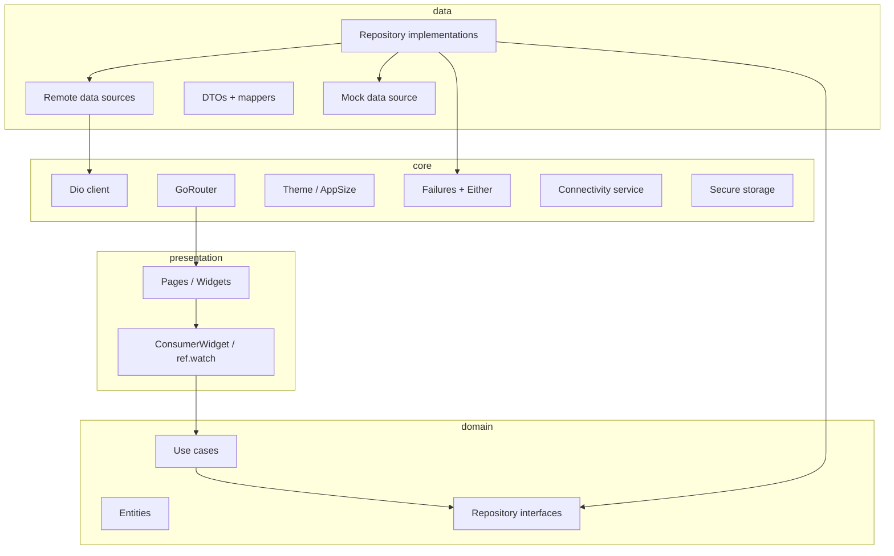
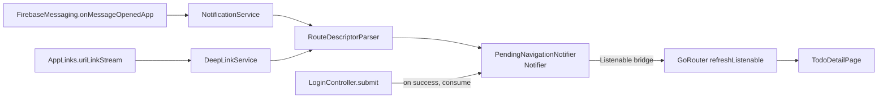

# Flutter Mobile Boilerplate

Production-ready Flutter boilerplate for **iOS + Android** consumer apps.
Feature-first Clean Architecture, Riverpod with codegen, GoRouter, Dio REST,
`fpdart` `Either` errors, full flavors, minimal auth stubs, and a Todo CRUD
example backed by a mock data source.

---

## Tech stack

| Concern | Choice |
|---------|--------|
| State management | Riverpod 2 (`@riverpod` codegen + sealed UI states) |
| Routing | GoRouter with auth redirect |
| Networking | Dio + auth interceptor + refresh + pretty logger (dev only) |
| Error handling | `Either<Failure, T>` via `fpdart`, localized via `Failure.toMessage` |
| Environments | Full flavors: `dev` / `staging` / `prod` |
| UI | Material 3, semantic theme extensions, `AppSize` |
| Responsive | `flutter_screenutil` |
| i18n | ARB codegen — English + Spanish |
| Example feature | Todo CRUD with Dio-backed remote data source |
| Storage | `flutter_secure_storage` (tokens only) |
| Offline | `connectivity_plus` + retry banner |
| Logging | `logger` (single `AppLogger`) |
| Push notifications | Firebase Cloud Messaging (`firebase_messaging`) |
| Deep linking | `app_links` — custom scheme + Universal/App Links |
| Branding | `flutter_launcher_icons` + `flutter_native_splash`, per-flavor |
| Tests | `flutter_test` + `mocktail` |
| CI | GitHub Actions — analyze, test, smoke build |
| SDK | Pinned via FVM (`3.41.8`) |

---

## Architecture



**Dependency rule:** `presentation → domain ← data`; `core` is shared infrastructure
and must not import from any feature. The lone exception is `core/network`:
the `AuthInterceptor` consumes `AuthRepository` (domain) via a deferred
callback so the dio can refresh expired tokens without `core` importing
the auth `data` layer directly.

---

## Folder structure

```
lib/
  main.dart                # default entry (flavor = dev)
  main_dev.dart            # dev entrypoint
  main_staging.dart        # staging entrypoint
  main_prod.dart           # production entrypoint
  app.dart                 # MaterialApp.router + ProviderScope
  bootstrap.dart           # framework init + flavor wiring
  core/
    config/                # Flavor + FlavorConfig
    connectivity/          # ConnectivityService
    error/                 # sealed Failure + Dio mapper
    logger/                # AppLogger
    network/               # DioClient + AuthInterceptor
    router/                # GoRouter + route constants + redirect
    storage/               # SecureStorageService
    theme/                 # AppTheme, semantic extensions, AppSize
    widgets/               # AppLoadingIndicator, AppErrorWidget, ConnectivityBanner
  assets/branding/         # Source icon_*.png + splash_*.png (per flavor)
  features/
    auth/
      domain/              # AuthRepository, LoginUseCase, AuthUser
      data/                # AuthRepositoryImpl, AuthRemoteDataSource
      presentation/        # LoginPage, providers, sealed LoginState
    todo/
      domain/              # Todo entity, repository interface, use cases
      data/                # DTO, mapper, mock + remote sources, repository impl
      presentation/        # TodoListPage, sealed states, controller
  l10n/                    # app_en.arb, app_es.arb
test/
  features/
    auth/data/             # AuthRepositoryImpl tests (mock remote source)
    todo/data/             # TodoRepositoryImpl CRUD tests (mock source)
    todo/domain/           # GetTodosUseCase test
  helpers/                 # Shared assertion extensions
```

---

## Prerequisites

- Flutter SDK pinned to **3.41.8** via FVM
- Xcode (latest) — iOS
- Android Studio + Android SDK — Android
- VS Code or Android Studio

Install FVM and pin the SDK:

```bash
brew tap leoafarias/fvm
brew install fvm
fvm install 3.41.8
fvm use 3.41.8
```

---

## Getting started

```bash
# 1. Install dependencies
fvm flutter pub get

# 2. Run code generation (Riverpod generator only)
fvm dart run build_runner build --delete-conflicting-outputs

# 3. Run the app (dev flavor)
fvm flutter run --flavor dev -t lib/main_dev.dart
```

### Flavor commands

```bash
# Dev
fvm flutter run --flavor dev -t lib/main_dev.dart

# Staging
fvm flutter run --flavor staging -t lib/main_staging.dart

# Prod
fvm flutter run --flavor prod -t lib/main_prod.dart
```

### Build

```bash
# Android APK
fvm flutter build apk --release --flavor prod -t lib/main_prod.dart

# iOS (unsigned)
fvm flutter build ios --release --flavor prod -t lib/main_prod.dart --no-codesign
```

---

## Demo credentials

The login form is pre-populated with `demo@example.com` / `password`. The
`AuthRepository` calls `POST /auth/login` against the configured base URL
(see **Environment / secrets** below). The base URL in `FlavorConfig` points
at `https://dev.api.example.com` by default — override via the
`BASE_URL` env variable or wire up a real backend before running.

---

## Environment / secrets

Base URLs and other per-flavor configuration are layered:

1. **Defaults** baked into `FlavorConfig.fromFlavor` (see
   `lib/core/config/flavor.dart`).
2. **`--dart-define`** overrides, read at compile time via
   `String.fromEnvironment`.
3. **`--dart-define-from-file=<path>`** overrides — the same mechanism the
   Flutter CLI accepts. JSON file shape mirrors `env.example.json`.

Supported keys:

| Key          | Description |
|--------------|-------------|
| `BASE_URL`   | API base URL the Dio client uses for every request. |
| `APP_NAME`   | Display name shown on the device home screen. |
| `DIO_LOGGING`| `true` / `false` — forces the pretty Dio logger on/off. |

Example runs:

```bash
# Inline override
fvm flutter run --flavor dev -t lib/main_dev.dart \
  --dart-define=BASE_URL=https://my-backend.example.com

# Whole-file override
fvm flutter run --flavor dev -t lib/main_dev.dart \
  --dart-define-from-file=env.dev.json
```

Templates for each flavor are checked in: `env.dev.json`, `env.staging.json`,
`env.prod.json`, and `env.example.json`. Real secrets belong in a
gitignored file like `env.prod.local.json` and should be passed via
`--dart-define-from-file` from your CI store rather than committed.

---

## Adding a new feature

1. Create `lib/features/<feature>/{domain,data,presentation}`.
2. **Domain**: define plain Dart entities (with hand-written `copyWith`/`==`),
   repository interface, use cases.
3. **Data**: add DTO + mapper, data source(s) (mock + Dio-backed), repository
   implementation that returns `Either<Failure, T>`.
4. **Presentation**: create the page widget(s) plus a `Notifier`/`AsyncNotifier`
   exposing sealed states. Register providers in a `*_providers.dart` file.
   Hold [Failure] objects in error states (not raw strings) and call
   `failure.toMessage(context)` at the render site.
5. **Routes**: add a `GoRoute` in `core/router/app_router.dart` and a typed
   constants class alongside (`FooRoutes`).
6. **Tests**: cover the repository implementation and at least one use case.

---

## Conventions

- **Errors**: every async API returns `Either<Failure, T>`. Callers `.fold()` on
  the result and never `try/catch` in presentation code. Error states hold
  the [Failure] object (not a pre-localized string) and call
  `failure.toMessage(context)` at the render site so l10n is centralised.
- **State**: prefer `sealed class` states over nullable `AsyncValue`s so the
  compiler enforces exhaustive rendering.
- **Routing**: navigate via `context.goNamed` / `context.pushNamed` only.
- **Theme**: never hard-code spacing, radii, or icon sizes — use `AppSize`.
- **Logging**: use `AppLogger`, never `print()`.
- **Auth refresh**: the [AuthInterceptor] attaches the bearer token, watches
  for 401s, and trades the refresh token for a fresh access token before
  retrying once. If refresh fails it clears stored tokens and flips
  `sessionExpiredProvider` so the router can redirect to login.

---

## Testing

```bash
fvm flutter test --reporter expanded
```

Unit-test coverage targets:
- `test/features/todo/data/todo_repository_impl_test.dart`
- `test/features/todo/domain/get_todos_use_case_test.dart`
- `test/features/auth/data/auth_repository_impl_test.dart`

No widget, golden, or integration tests per scope.

---

## App branding (icons + splash)

Source assets live in `assets/branding/` — one icon and one splash per
flavor, so dev/staging/prod are visually distinguishable on the home screen
and during launch:

| Flavor  | Icon | Splash |
|---------|------|--------|
| dev     | green rounded square, "D" letter mark | green background, "D" |
| staging | orange rounded square, "S" letter mark | orange background, "S" |
| prod    | blue rounded square, "P" letter mark | blue background, "P" |

The configs live next to `pubspec.yaml`:

- `flutter_launcher_icons-dev.yaml` / `-staging.yaml` / `-prod.yaml`
- `flutter_native_splash-dev.yaml` / `-staging.yaml` / `-prod.yaml`

Generated outputs:

- **Android** — `android/app/src/{dev,staging,prod}/res/mipmap-*/ic_launcher.png`
  plus per-flavor `drawable/launch_background.xml` and `values/styles.xml`.
- **iOS** — `ios/Runner/Assets.xcassets/AppIcon-{dev,staging,prod}.appiconset/`
  plus `LaunchImage{Dev,Staging,Prod}.imageset/`.

Regenerate everything (the tool discovers every `flutter_launcher_icons-*.yaml`
and `flutter_native_splash-*.yaml` in the project root):

```bash
fvm dart run flutter_launcher_icons
fvm dart run flutter_native_splash:create -A
```

To replace the placeholder artwork with real branding, drop new
`icon_<flavor>.png` (1024×1024) and `splash_<flavor>.png` (1242×2436)
into `assets/branding/` and rerun the commands above. Regenerate the
color-coded placeholders with:

```bash
python3 assets/branding/_generate_placeholders.py
```

---

## Push notifications & deep links

Both push taps and incoming links (custom scheme + https Universal/App Links)
flow through one router. A single `PendingNavigationNotifier`
(`lib/core/notifications/pending_navigation_service.dart`) holds the queued
destination; the `GoRouter` watches it via a `Listenable` bridge and the
`redirect` callback decides what to do (deliver, redirect to login, or pass
through).



### Supported link shapes

| Source | URI | `RouteDescriptor` |
|--------|-----|-------------------|
| Custom scheme (dev) | `boilerplate-dev://todos/42` | `path: /todos/42` |
| Custom scheme (dev) | `boilerplate-dev://todos/42?focus=title` | `path: /todos/42`, `query: {focus: title}` |
| Custom scheme (prod) | `boilerplate://todos/42` | `path: /todos/42` |
| https (Universal / App Link) | `https://example.com/todos/42` | `path: /todos/42` |

Anything not under `/todos/...` returns `null` from the parser and is logged
but ignored (so a malicious link cannot push the user to an arbitrary route).

### Push payload shape (data message)

```json
{
  "route": "/todos/42",
  "extra_focus": "title",
  "extra_source": "campaign-2026-06"
}
```

`RouteDescriptorParser.parsePushPayload` looks for `route` (required) and
collects everything else into `extra`. `query` is not derivable from push
payloads — if you need query params, encode them in the path.

### Auth interaction

When the user is unauthenticated and taps a link, the router redirects them to
`/login`. After `LoginController.submit()` returns `true`, `LoginPage` calls
`pendingNavigationProvider.notifier.consume()` and navigates to the queued
destination if one exists. Without a queued destination the router's auth
guard takes over and sends the user to `/`.

### Routes

| Path | Page | Notes |
|------|------|-------|
| `/` | `TodoListPage` | Auth-guarded |
| `/login` | `LoginPage` | Redirects to `/` once authed |
| `/todos/:id` | `TodoDetailPage` | Demonstrates `pathParameters` + `extra`. Highlights the title when `extra['focus'] == 'title'`. |
| (unknown) | `UnknownRoutePage` | `errorBuilder` — renders an `AppErrorWidget` with a "Go home" action |

### Programmatic navigation

```dart
// In a Notifier or controller, enqueue a destination from anywhere:
ref.read(pendingNavigationProvider.notifier).enqueue(
  const RouteDescriptor(
    path: '/todos/42',
    extra: {'focus': 'title'},
  ),
);
// GoRouter refreshes on the next microtask.

// From a widget, prefer:
context.goNamed(TodoRoutes.detail, pathParameters: {'id': '42'});
```

### Testing links & push end-to-end

```bash
# Android — custom scheme (while app is open or cold-started)
adb shell am start -W -a android.intent.action.VIEW \
  -d "boilerplate-dev://todos/42" com.example.flutter_clean_riverpod_boilerplate.dev

# Android — Universal Link (requires dev-signed device + .well-known/assetlinks.json)
adb shell am start -W -a android.intent.action.VIEW \
  -d "https://example.com/todos/42" com.example.flutter_clean_riverpod_boilerplate.dev

# iOS — custom scheme
xcrun simctl openurl booted "boilerplate-dev://todos/42?focus=title"

# iOS — Universal Link
xcrun simctl openurl booted "https://example.com/todos/42"

# Push — Firebase Console → Cloud Messaging → New campaign → "Send test message"
# data: { "route": "/todos/42", "extra_focus": "title" }
```

### One-time Firebase setup

1. Create a Firebase project; download `google-services.json` for Android and
   `GoogleService-Info.plist` for iOS.
2. Drop `google-services.json` into `android/app/src/{dev,staging,prod}/` and
   `GoogleService-Info.plist` into `ios/Runner/{Dev,Staging,Prod}/`.
   The `.example` placeholders in those folders document the structure.
3. Host `/.well-known/assetlinks.json` (Android) and
   `/apple-app-site-association` (iOS) on the marketing domain to enable
   https Universal / App Links with `autoVerify`.
4. For the custom scheme, no extra setup is required beyond what's already in
   `AndroidManifest.xml` (intent filters per flavor) and `Info-*.plist`
   (`CFBundleURLTypes`).

The real config files are gitignored; only the `.example` templates are
checked in.

### Testing

- `test/core/notifications/route_descriptor_parser_test.dart` — pure parser
  cases (custom scheme + https, query params, malformed URIs, push payloads).
- `test/core/notifications/pending_navigation_notifier_test.dart` —
  enqueue / consume / clear semantics, plus the bridge firing
  `notifyListeners` once per change.
- `test/core/router/pending_navigation_aware_redirect_test.dart` — the pure
  redirect function: given `location + auth + pending`, returns the right
  destination (or null).
- `test/core/notifications/fcm_notification_service_test.dart` — wraps
  `FirebaseMessaging.onMessageOpenedApp` with a fake stream and asserts the
  service forwards a `RouteDescriptor`.
- `test/core/notifications/app_links_deep_link_service_test.dart` — wraps
  `AppLinks().uriLinkStream` with a fake and asserts the service forwards
  URIs.
- `test/features/todo/presentation/todo_detail_page_test.dart` — widget test
  for the new demo page (closes the integration story).

---

## Platforms

This boilerplate ships **iOS + Android** only. Web, macOS, Linux, and Windows
folders remain in the repo (Flutter tooling expects them) but are not built
or tested in CI.

---

## License

MIT.